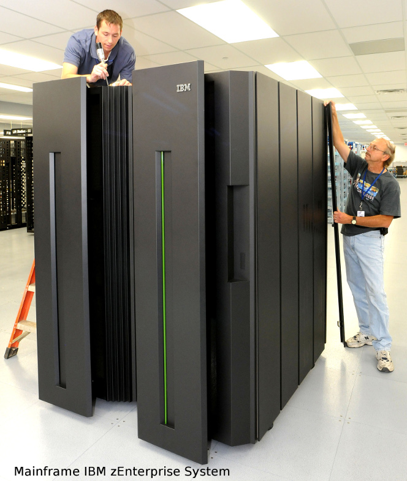
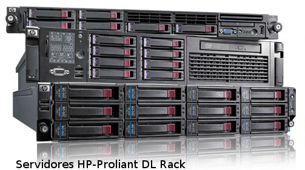
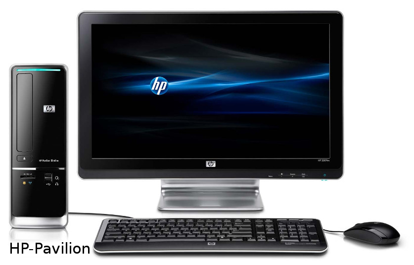
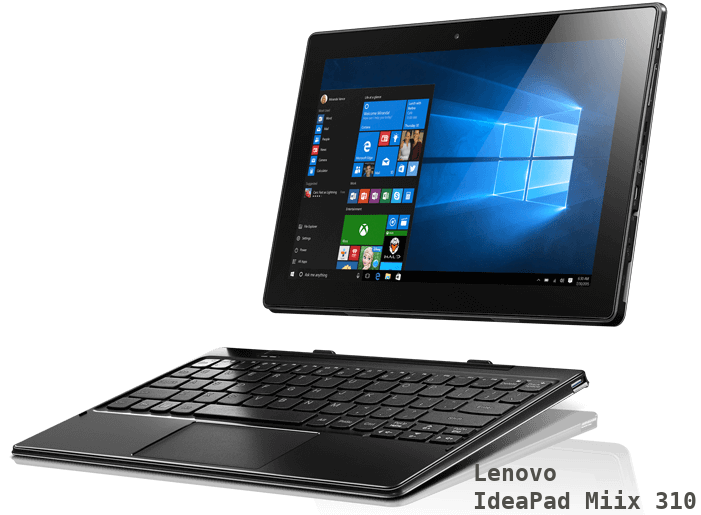
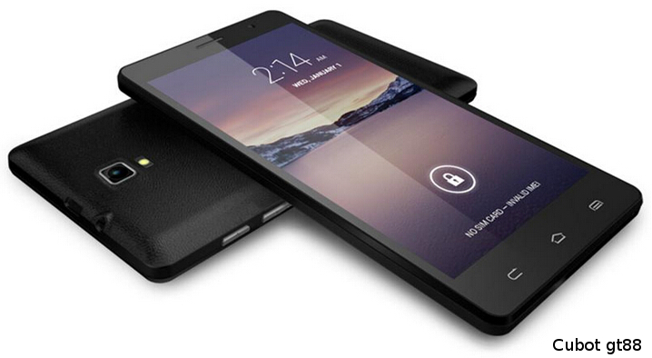
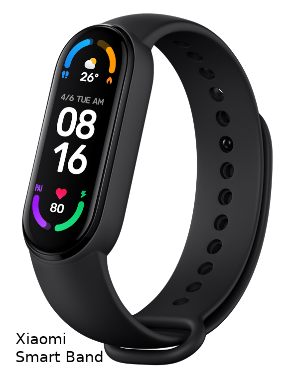
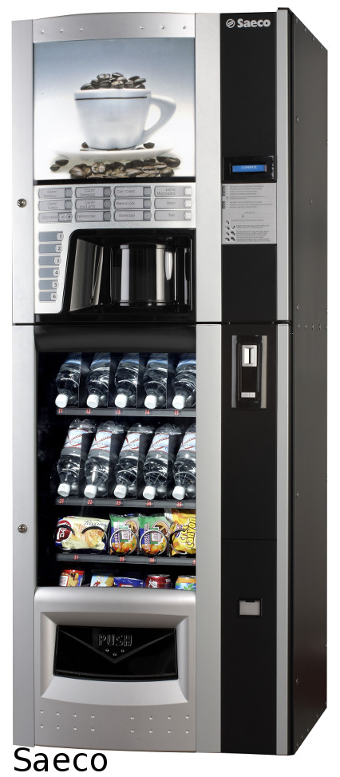
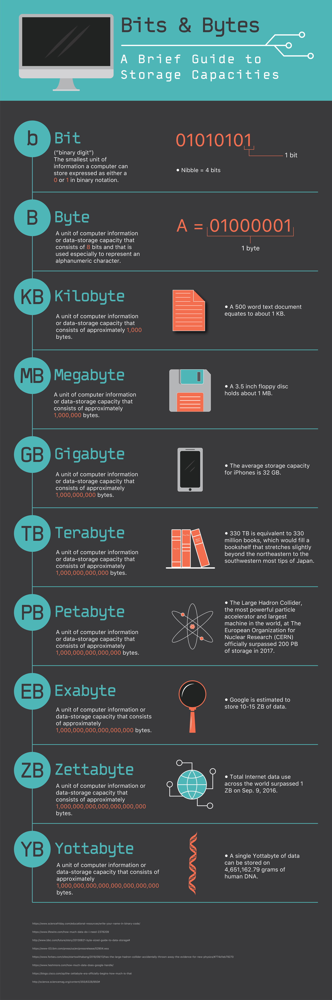
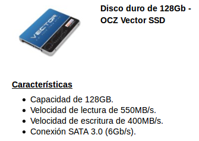

# El sistema informático. Software y hardware.

## Concepto de ordenador y sistemas informáticos

Podemos definir un ***ordenador*** o computadora como un dispositivo electrónico con capacidad para recibir información, almacenarla durante un tiempo, procesarla para obtener un resultado y ofrecerlo al exterior. Por tanto, sus funciones básicas son:

 * *Transmitir información*. Mediante dispositivos de entrada/salida, el ordenador recibe información del exterior que estos dispositivos codifican a un formato que el ordenador entienda y decodifican el resultado para mostrarlo al usuario. Estos dispositivos también reciben el nombre de periféricos, como por ejemplo, el teclado, el ratón, el monitor, la impresora.
 * *Almacenar información*. Los dispositivos de almacenamiento se encargar de conservar la información que el ordenador necesita para llevar a cabo sus funciones. Los más comunes son la memoria RAM (o memoria volátil) y el el disco duro (independientemente del tipo de éste). Otros dispoditivos de almacenamiento son las cintas magnéticas, los llamados pendrives, etc.
 * *Procesar información*. Es el componente principal del ordenador y se encarga de leer las intrucciones de la memoria RAM y ejecutarlas según un orden preestablecido.

Por su parte, los ***sitemas informáticos*** están compuestos por el Hardware o componentes físicos, el Software o soporte lógico que dirige el ordenador hacia una tera determinada para conseguir unos resultados y, por último, los recursos humanos, que incuye tanto a los usuarios cómo a los responsables crear y mantener dichos sistemas.

### Hardware

En relación al hardware, según la forma de conectarse, distinguimos entre:

 * *Componentes internos*: formados por la placa base (motherboard) y el resto de dispositivos conectados directamente a ella, como microprocesador, memoria RAM, disco duro, tarjetas de vídeo, de red, ...
 * *Componentes externos*: son aquellos que se conectan desde los diferentes puertos situados en la carcasa externa del equipo y se conocen como periféricos. Éstos se clasifican, a su vez, en

   + _Periféricos de entrada_: introducen datos en el ordenador (ratón, teclado, escáner, tableta digitalizadora, ...)
   + _Periféricos de salida_: muestran los resultados de la información procesada (monitor, proyectos, impresora, altavoces, ...)
   + _Periféricos de entrada/salida_ (E/S en inglés I/O): se utilizan tanto para entrada como para salida, por ejemplo los 'pendrives', discos externos, router, ...

### Tipos de software

Según su función, se suele clasificar el software como:

a) *Software base*. Comunica el resto de software con el hardware para llevar a cabo las acciones solicitadas por los usuarios. Los sistemas operativos son software base.

b) *Software de aplicación*. Son los programas que realizan tareas específicas y se diferencian en:

   * De aplicación horizontal: aplicaciones de tipo genérico que solucionan tareas de varios tipos, como los procesadores de texto, hojas de cálculo, etc.
   * De aplicación vertical: programas que se crean para solventar necesidades determinadas, como los videojuegos.

c) *Software diagnóstico*. Se utiliza para mantener y reparar los equipos como los antivirus, comprobación de la memoria, comprobación del estado del disco, etc.

### Tipos de ordenadores

Según la función a la que están destinados, podemos clasificarlos en:

1. **Superordenadores**: Tienen una gran capacidad de cálculo (muy superior al resto).

   Estos ordenadores suelen presentar un gran consumo de energía, que también produce temperaturas elevadas, lo que obliga a ubicarlos en ambientes controlados con sistemas de refrigeración potentes.

   En muchos casos, en realidad están constituidos por muchos ordenadores que, unidos, son capaces de ofrecer un gran rendimiento. Por este motivo, en los últimos tiempos tiende a hablarse de ambientes de cálculo de alto rendimiento, en lugar de hablar de superordenadores.

   Es frecuente que este tipo de entornos se utilice en ambientes relacionados con la investigación, científicos o militares.

   Podemos encontrar una lista de los 500 mayores supercomputadores en http://top500.org/. La lista se actualiza dos veces al año: en junio y en noviembre.

   { height=50mm }

2. **Mainframes**, **macroordenadores** u **ordenadores centrales**: Son ordenadores muy potentes, utilizados para procesar gran cantidad de datos.

   Suelen encontrarse en grandes empresas como bancos, compañías de seguros, grandes empresas de comercio electrónico, etc.
   Además de destacar por su velocidad de cálculo, también suelen hacerlo por su gran capacidad de almacenamiento.
   Normalmente realizan cálculos más simples que un superordenador, pero que implican a grandes volúmenes de datos.
   En muchas ocasiones, las empresas no adquieren el ordenador, sino que alquilan una determinada capacidad de cálculo al fabricante. Este último se encargará de ofrecer el servicio de forma ininterrumpida, pudiendo llegar a efectuar reparaciones sin apagar el ordenador u ofrecer ordenadores de sustitución mientras se subsana el problema.

3. **Servidores**: Son ordenadores que forman parte de una red, local o ampliada, en la que ofrecen servicios a otros ordenadores de menor entidad.

   { width=2cm }

   En muchos casos, suelen desempeñar roles particulares dentro de la red (Servidor de archivos, de impresión, de base de datos, web, etc).
   Cuando el servicio que ofrecen es muy exigente (por ejemplo el servidor de una base de datos), se tratará de un ordenador con prestaciones avanzadas. Sin embargo, existen servidores de escasa potencia que ofrecen servicios poco exigentes (como puede ser un servidor de impresión).

   { width=2cm }

4. **Ordenadores personales (PC)**: En esta categoría se encuentran los ordenadores que utilizamos los usuarios de forma individual. Pueden estar destinados a tareas tan variadas como trabajos de oficina u ofimáticos, navegación por Internet o entretenimiento y su perfil cambiará en función del uso al que estén destinados.

   Por ejemplo, los requisitos de un ordenador destinado al entretenimiento pueden ser mucho más elevados que los de otro dedicado a escribir documentos o a navegar por Internet.
   En esta categoría encontramos multitud de dispositivos con perfiles claramente diferenciados, por lo que, a su vez, los dividiremos en diferentes subcategorías:

   * **Ordenadores de sobremesa**

      Están pensados para permanecer en una ubicación estable y, normalmente se configuran con una unidad central y una serie de dispositivos conectados (monitor, teclado, ratón, impresora, …)

   * **Ordenadores portátiles**: 

      Están pensados para ser transportados. Normalmente ofrecen una configuración en la que el monitor se pliega sobre el teclado (que contiene a su vez los componentes principales del equipo).

      Recientemente han ido apareciendo varias subcategorías de ordenadores portátiles que debemos mencionar:

      - Los *netbooks*, que son ordenadores muy ligeros y con potencia limitada que están pensados para realizar tareas básicas.
      - Los *ultrabook*, que tienen la misma potencia de un ordenador portátil normal, pero reduciendo al máximo su peso y su tamaño.
      - Los *convertibles*, que pueden ofrecer la capacidad y la potencia de un ordenador portátil tradicional, pero añadiendo una pantalla táctil e incorporando la capacidad de retirar el teclado para convertirlos, prácticamente, en una Tabletacon capacidades avanzadas..

   { width=2cm }

   **Dispositivos de bolsillo**

      Se trata de dispositivos de tamaño reducido, pantalla táctil y potencia limitada que aspiran a ofrecer todo tipo de funcionalidad (como bloc de notas, listas de contactos, calendarios, etc).

   { width=2cm }

      Los primeros dispositivos de este tipo se llamaban Asistentes Digitales Personales o, más frecuentemente PDAs, de su nombre en inglés, Personal Digital Assistants.

      Sin embargo, en la actualidad han sido sustituidos por los teléfonos móviles de última generación, que suelen recibir el nombre genérico de smartphones, y que, además de asumir todas las funciones de las antiguas PDAs, han incorporado funciones nuevas como reproducción multimedia… ¡e incluso permiten hablar por teléfono!

   { width=2cm }

    **Dispositivos Wearables**

      Podríamos traducir su nombre como vestible o llevable y se trata de dispositivos electrónicos que están diseñados para acompañarnos constantemente. En muchos casos están orientados a controlar nuestra actividad física o nuestra salud y suelen presentarse en forma de pulsaras o relojes inteligentes (para los que suele usarse su nombre en inglés: smartband o smartwatchs), pero pueden ser también colgantes, anillos o prendas de vestir (por ejemplo, zapatillas deportivas que incorporen GPS).
      Las características concretas dependen de cada dispositivo, pero en muchos casos, pueden recibir llamadas telefónicas, correos electrónicos, notificaciones o incluso podremos instalar nuevos programas o actualizar los ya existentes. 
      Normalmente están diseñados para interactuar con un smartphones a través de un software específico.

5. **Ordenadores empotrados** (o embebidos, del inglés embedded). Se trata de ordenadores diseñados para realizar funciones específicas, es decir, no son de propósito general. Tampoco tienen el aspecto que solemos asociar con un ordenador, incluso, muchas veces, no suelen estar a la vista.

   Como ejemplos, podemos mencionar las máquinas de vending(las típicas máquinas de refrescos), los cajeros automáticos, ordenadores de abordo de un vehículo, decodificadores para la televisión de pago y un largo etcétera.

   { heigth=5cm }

# Medidas de la información. Capacidad y velocidad

## Capacidad de almacenamiento

En informática se utilizan medidas para calcular la cantidad de información que se pueda procesar, almacenar, enviar o recibir.

El bit (binary digit, representado por el símbolo 'b') es la unidad mínima de información y equivale a uno de los 2 estados: encendido (o verdadero, '1') y apagado (falso, '0'). 

Cómo 1 bit es una unidad muy pequeña, se suele trabajar con bytes (8 bits) como unidad básica. Los siguientes múltiplos se obtienen multiplicando por 1024 (210) y reciben los nombres de Kilobyte (KB), Megabyte (MB), Gigabyte (GB), Terabyte (TB), Petabyte (PB), Exobyte (EB) y Zettabyte (ZB).

{ height=50% }.

También existen ciertas agrupaciones de bits que reciben los siguientes nombres:

 * Nibble: equivale a 4 bits
 * Byte u octeto: 8 bits
 * Word: 2 Bytes ó 16 bits
 * Dword (double word): 4B = 32b
 * Qword (quad word): 8B = 64b

## Velocidad de transmisión

La velocidad a la que puede enviarse la información de un dispositivo a otro (conocida como bit rate) es la cantidad de bits que pueden transmitirse en cada segundo (bits por segundo, bps o b/s).

Como múltiplo, podemos utilizar bytes por segundo (B/s), que se corresponderá a la velocidad en bps dividida entre ocho.

Por encima de estos valores, podemos encontrar los siguientes múltiplos:

|        Unidad        |    Abreviatura   | Nº de bps  |
|         :---         |       :---:      |     ---:   |
| kilobit por segundo  | kbps kbit/s kb/s |   10^3^    |
| kilobyte por segundo |     kBps kB/s    | 8 x 10^3^  |
| megabit por segundo  | Mbps Mbit/s Mb/s |   10^6^    |
| megabyte por segundo |     MBps MB/s    | 8 x 10^6^  |
| gigabit por segundo  | Gbps Gbit/s Gb/s |   10^9^    |
| gigabyte por segundo |     GBps GB/s    | 8 x 10^9^  |
| terabit por segundo  | Tbps Tbit/s Tb/s |   10^12^   |
| terabyte por segundo |     TBps TB/s    | 8 x 10^12^ |
Table: Unidades de velocidad

???+ note "Tip"

    Recuerda que 1 bit es la unidad básica y 1 byte son 8 bits

A modo de ejemplo del uso de las medidas de información relacionadas tanto con el tamaño de los dispositivos, como con la velocidad de transmisión, veamos un ejemplo típico que anuncia las características de un dispositivo de almacenamiento externo:

{ width=50mm }

