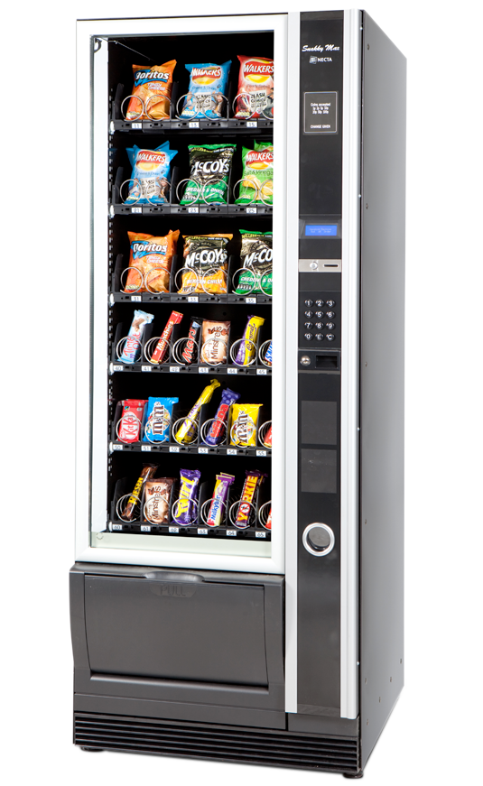

# Actividades de iniciación


## Descubre tus conocimientos previos contestando en tu cuaderno las siguientes preguntas:

 1. Enumera cinco robots o automatismos que utilices a dario o que tengas cerca de tu entorno doméstico.
 2. Enumera cinco cosas que puedan hacer los robots que nos rodean. Piensa en los robots que hayas visto en las noticias.
 3. Las personas utilizamos nuestros cinco sentidos: vista, oído, tacto, olfato y gusto. ¿Qué sentidos crees que podemos desarrollar en un robot?
 4. ¿Cómo crees que detecta la temperatura un equipo de aire acondicionado?
 5. Explica cómo crees que es el funcionamiento para mantener la temperatura de una habitación a 21 grados.

---

# Introducción

<iframe width="560" height="315" src="https://youtu.be/WlQNLSKwM5Q?si=A1XDhU7tYKqFleT7" title="YouTube video player" frameborder="0" allow="accelerometer; autoplay; clipboard-write; encrypted-media; gyroscope; picture-in-picture" allowfullscreen></iframe>

---

# Atumatismos y robots

 * ***Automatismo***: mecanismo o máquina que realiza una tarea concreta, pero cuyo funcionamiento no se puede modificar una ez accionado. Ejemplos: tostadora, cisterna del wáter, máquina de vending

 

 * ***Robot***: máquina automática *progamable*, que capta información del entorno y actúa en consecuencia

 

---

# Tipos de robot según **ámbito de uso**

 * **Robótica industrial**: soldadura, corte, pintura, movimiento de piezas, ensamblado, ...
 * **Robótica de servicio**: aspiradores, educativos, de ayuda, ...
 * **Robótica médica**: operaciones, tratamientos, prótesis, ...  (nanorobots)
 * **Robótica terrestre, marítima y aérea**: vehículos autónomos, submarinos, drones
 * **Robótica de seguridad y defensa**: detección de explosivos, rastreadores, vigilancia, ...


---

# Tipos de robot según **morfología** (forma)

 * Androides
 * Zoomórficos
 * Poliaticulados
 * Móviles


---

# Funcionamiento de un robot

 * **Sensores**: recogen información del entorno
 * **Controlador**: procesa información de los sensores y envía órdenes a los actuadores
 * **Actuadores**: (motores, luces, …) realizan las acciones que indica la controladora

---

    <iframe width="560" height="315"
      src="https://youtu.be/z5IqRReRKtA?si=dpKBI4Ri8MGLZ4n-"
      title="YouTube video player" frameborder="0"
      allow="accelerometer; autoplay; clipboard-write; encrypted-media; gyroscope; picture-in-picture"
      allowfullscreen >
    </iframe>


---

# Sensores: captan información del entorno


---

# Actuadores: ejecutan acción


---

# Tarjeta controladora micro:bit

 


??? question "Quina és la estructura d'un programa Python?"

    ```python
        import os
        def main():
            # Ací el teu codi en python
            print("Hol, mon!")

        if __name__ == "__main__":
            main()
    ```

    Copia i prova el teu codi a un IDE

